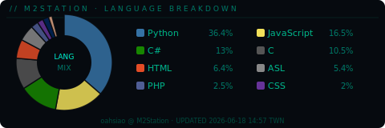

<!-- ═══════════════════════════════════════════════════════════════ -->
<!--  oahsiao · GitHub Profile README                              -->
<!--  SVGs auto-updated daily via GitHub Actions                   -->
<!-- ═══════════════════════════════════════════════════════════════ -->

---

---

### `M2STATION · MEMBER LEADERBOARD`

> Auto-generated daily from private org repositories via GitHub Actions

---

### `M2STATION · DAILY COMMIT TREND`

> All-repo daily commit volume over the last 90 days

---

### `M2STATION · LATEST 10 CHANGES`

> Newest commits across all org repos · click a commit to open the change

<!-- LATEST-CHANGES:START -->
01. [`M2_WIKI@2acb370`](https://github.com/M2Station/M2_WIKI/commit/2acb370a6e5e0d9d2a3cc89db8b4d4ef2e66bad2) — automation test suite file configuration · `2026-06-09` · Linpei727
02. [`.github@ee82f91`](https://github.com/M2Station/.github/commit/ee82f91e62b8e5596b4a31bdd876c0dadcad18b1) — chore: sync latest changes [skip ci] · `2026-06-09` · github-actions[bot]
03. [`M2_WIKI@2a27b5b`](https://github.com/M2Station/M2_WIKI/commit/2a27b5b27582f0a0990504c8cdc9417f885ef1d7) — fix · `2026-06-09` · asuka-wu
04. [`M2_WIKI@7dcd09d`](https://github.com/M2Station/M2_WIKI/commit/7dcd09dc9e1965f2cd9632c32bd4eb857766b04b) — fix pic · `2026-06-09` · asuka-wu
05. [`M2_WIKI@de5b1c2`](https://github.com/M2Station/M2_WIKI/commit/de5b1c2d7c686ec22c9d941685021fddaeebafb3) — move RF var to RF power table · `2026-06-09` · asuka-wu
06. [`.github@9e84ce6`](https://github.com/M2Station/.github/commit/9e84ce60c03c77cb69c4982029e252d380c18631) — chore: sync latest changes [skip ci] · `2026-06-08` · github-actions[bot]
07. [`M2_DEVOPS@9d7ba78`](https://github.com/M2Station/M2_DEVOPS/commit/9d7ba784cf835717bdef06cd0608d76d18380ccf) — fix(pat-autorenew): correct self-referencing filename in ... · `2026-06-08` · oahsiao
08. [`M2_GIT_DIFF@b827e46`](https://github.com/M2Station/M2_GIT_DIFF/commit/b827e4644e0f3e2c3a363eafb104086482a3cc69) — 0.1.7 · `2026-06-07` · oahsiao
09. [`M2_GIT_DIFF@594cdf9`](https://github.com/M2Station/M2_GIT_DIFF/commit/594cdf9395d632b85efc105a331237176613853e) — chore: speed up single-folder context launch · `2026-06-07` · oahsiao
10. [`M2_GIT_DIFF@1c3cef5`](https://github.com/M2Station/M2_GIT_DIFF/commit/1c3cef55c0807d780d8b0535e06d4a1170d5d011) — chore: use assisted installer flow · `2026-06-07` · oahsiao
<!-- LATEST-CHANGES:END -->

---

### `ACTIVITY`

---

<code>AUTO-SYNC DAILY 10:00 TWN</code>
 

