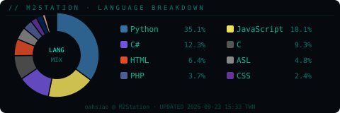

<!-- ═══════════════════════════════════════════════════════════════ -->
<!--  oahsiao · GitHub Profile README                              -->
<!--  SVGs auto-updated daily via GitHub Actions                   -->
<!-- ═══════════════════════════════════════════════════════════════ -->

---

---

### `M2STATION · MEMBER LEADERBOARD`

> Auto-generated daily from private org repositories via GitHub Actions

---

### `M2STATION · DAILY COMMIT TREND`

> All-repo daily commit volume over the last 90 days

---

### `M2STATION · LATEST 10 CHANGES`

> Newest commits across all org repos · click a commit to open the change

<!-- LATEST-CHANGES:START -->
01. [`M2_APEX@1db9432`](https://github.com/M2Station/M2_APEX/commit/1db9432783bc6c77ce31f1a6b162f5ea3a44f8d0) — feat(settings): add checkbox toggle for GitHub Copilot AI... · `2026-08-17` · oahsiao
02. [`M2_GIT_DIFF@204e721`](https://github.com/M2Station/M2_GIT_DIFF/commit/204e7211ac1b69961ba8df9455a07605935bf7e8) — chore(dev-deps): bump @napi-rs/canvas in the npm-minor-an... · `2026-08-17` · dependabot[bot]
03. [`M2_GIT_DIFF@64967d2`](https://github.com/M2Station/M2_GIT_DIFF/commit/64967d23bcb99a21853f19c58b9fd6ebeb4b9676) — chore(dev-deps): bump electron in the electron group · `2026-08-17` · dependabot[bot]
04. [`M2_GIT_DIFF@3b54164`](https://github.com/M2Station/M2_GIT_DIFF/commit/3b541644b40919ab81361a463615e040a48d60e8) — chore(dev-deps): bump vite in the vite-vitest-toolchain g... · `2026-08-17` · dependabot[bot]
05. [`.github@c0f6961`](https://github.com/M2Station/.github/commit/c0f69619e859fa5d6b722c7c2c3554f83d15a463) — chore: sync latest changes [skip ci] · `2026-08-16` · github-actions[bot]
06. [`.github@3b95ebc`](https://github.com/M2Station/.github/commit/3b95ebcb6f16028b894303902f478a93d21f3836) — chore: sync latest changes [skip ci] · `2026-08-15` · github-actions[bot]
07. [`M2_ARTBANK@aa59ed5`](https://github.com/M2Station/M2_ARTBANK/commit/aa59ed57116e855c1f46d739bf1fcc76540e0f89) — update ANDROID_APP/README.md · `2026-08-14` · oahsiao
08. [`M2_ARTBANK@96bbeef`](https://github.com/M2Station/M2_ARTBANK/commit/96bbeef8af32e6b8e317bd49acf17341bbd85690) — feat(android): add M2 ArtBank Android app (new item + mul... · `2026-08-14` · oahsiao
09. [`M2_ARTBANK@e2895c8`](https://github.com/M2Station/M2_ARTBANK/commit/e2895c83b9cb927a7798029625c930be034b7e0f) — fix(thumbs): apply EXIF orientation before generating thu... · `2026-08-14` · claude
10. [`.github@f97c3b3`](https://github.com/M2Station/.github/commit/f97c3b335dcd51599c99a6e1109dee4a3617d730) — chore: sync latest changes [skip ci] · `2026-08-14` · github-actions[bot]
<!-- LATEST-CHANGES:END -->

---

### `ACTIVITY`

---

<code>AUTO-SYNC DAILY 10:00 TWN</code>
 

