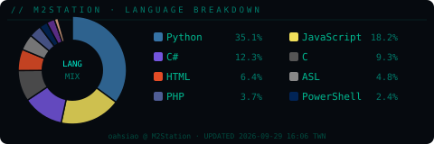

<!-- ═══════════════════════════════════════════════════════════════ -->
<!--  oahsiao · GitHub Profile README                              -->
<!--  SVGs auto-updated daily via GitHub Actions                   -->
<!-- ═══════════════════════════════════════════════════════════════ -->

---

---

### `M2STATION · MEMBER LEADERBOARD`

> Auto-generated daily from private org repositories via GitHub Actions

---

### `M2STATION · DAILY COMMIT TREND`

> All-repo daily commit volume over the last 90 days

---

### `M2STATION · LATEST 10 CHANGES`

> Newest commits across all org repos · click a commit to open the change

<!-- LATEST-CHANGES:START -->
01. [`M2_SKILLS@5bfd666`](https://github.com/M2Station/M2_SKILLS/commit/5bfd6660200e30c88364139fac1b650b11c834fe) — fix(config): prevent duplicate and partial TOML writes · `2026-10-02` · oahsiao
02. [`M2_SKILLS@992360f`](https://github.com/M2Station/M2_SKILLS/commit/992360f5e4055a8735e14761c4dd9076cebe68c3) — Update GO.BAT to auto-install pip deps in dev mode · `2026-10-02` · oahsiao
03. [`M2_SKILLS@121aca9`](https://github.com/M2Station/M2_SKILLS/commit/121aca995181ea689ae2fbb38327540ebdf2ffe9) — Add GO.BAT launcher for M2 CODEX PROXY GUI · `2026-10-02` · oahsiao
04. [`M2_SKILLS@15e3cd7`](https://github.com/M2Station/M2_SKILLS/commit/15e3cd7d9b7b34b5079877d44abf1e0380a5fcf3) — Enhance codex_recovery_proxy_v2 with GUI log callback and... · `2026-10-02` · oahsiao
05. [`M2_SKILLS@a572076`](https://github.com/M2Station/M2_SKILLS/commit/a572076a321c2bf761aa68d675e2a39671b70de7) — Add M2 CODEX PROXY GUI (onedir packaging, logo, dialog fix) · `2026-10-02` · oahsiao
06. [`M2_WIKI@62d5323`](https://github.com/M2Station/M2_WIKI/commit/62d53232bbde78db1c20afa1be7dbca8232729ac) — Add ANDROID_STARTUP.md · `2026-10-02` · oahsiao
07. [`M2_APEX@664a526`](https://github.com/M2Station/M2_APEX/commit/664a526b0d336529e93d9ce95f13a1346adb6533) — v0.5.16 · `2026-10-02` · oahsiao
08. [`M2_PUBLIC_RELEASE@6f5c4cd`](https://github.com/M2Station/M2_PUBLIC_RELEASE/commit/6f5c4cd8858f571c41c275cda2d7e0e7e53788c4) — chore(m2-apex): publish v0.5.16 · `2026-10-02` · oahsiao
09. [`M2_PUBLIC_RELEASE@09c124a`](https://github.com/M2Station/M2_PUBLIC_RELEASE/commit/09c124af90dd8481783c248115932b6bdf4a1ba6) — chore(m2-apex): publish v0.5.15 · `2026-10-02` · oahsiao
10. [`M2_APEX@d291424`](https://github.com/M2Station/M2_APEX/commit/d291424f4486c0bd48a9fabcc6ce2be25330f28a) — v0.5.14 · `2026-10-02` · oahsiao
<!-- LATEST-CHANGES:END -->

---

### `ACTIVITY`

---

<code>AUTO-SYNC DAILY 10:00 TWN</code>
 

